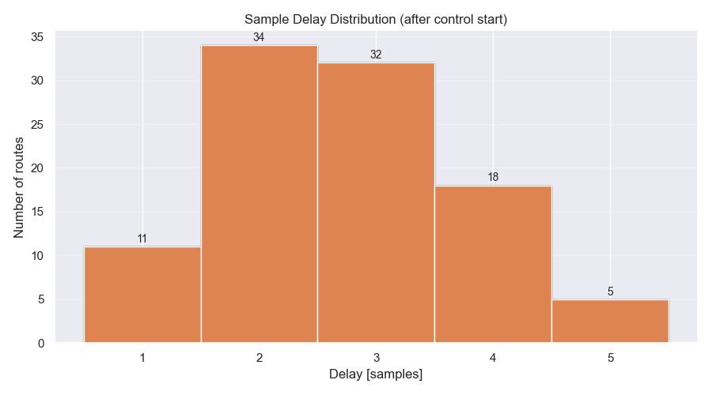
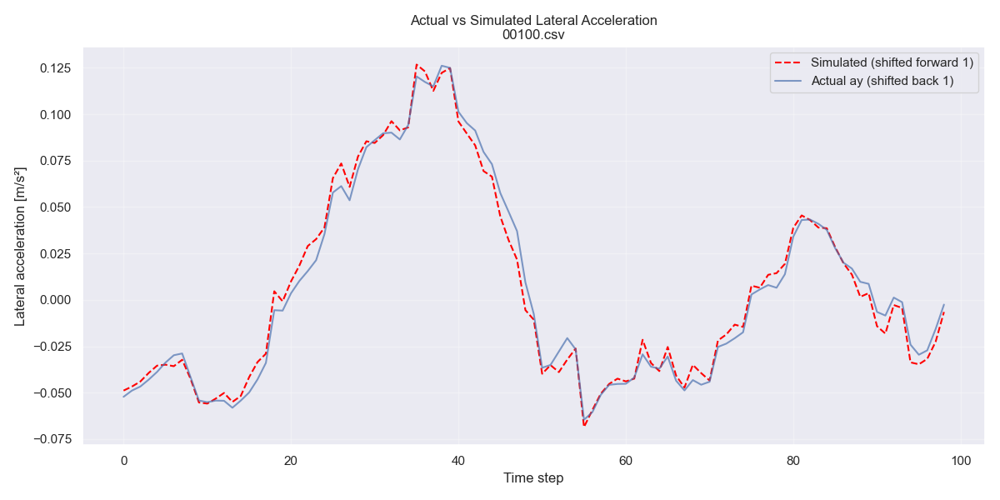

# Background  

Controls challenge by commaai.

## TinyPhysics

The TinyPhysics model is a "simulated car" that has been trained to mimic a very simple physics model (bicycle model) based simulator, given realistic driving noise. It is an autoregressive model similar to [ML Controls Sim](https://blog.comma.ai/096release/#ml-controls-sim) in architecture. Its inputs are the car's longitudinal velocity (`v_ego`), Longitudinal acceleration (`a_ego`), lateral acceleration due to road roll (`road_lataccel`), current car lateral acceleration (`current_lataccel`), and a steer input (`steer_action`).  
It's output is a prediction of the resultant lateral acceleration of the car.

## Controllers
Your controller should implement a new [controller](https://github.com/commaai/controls_challenge/tree/master/controllers). This controller can be passed as an arg to run in-loop in the simulator to autoregressively predict the car's response.

## Getting Started
We'll be using a synthetic dataset based on the [comma-steering-control](https://github.com/commaai/comma-steering-control) dataset for this challenge. These are actual car and road states from [openpilot](https://github.com/commaai/openpilot) users.

## Evaluation

Each rollout will result in 2 costs:

- `lataccel_cost`:  
  $$
  \frac{\sum (\mathrm{actual\_lat\_accel} - \mathrm{target\_lat\_accel})^2}{\mathrm{steps}} \times 100
  $$

- `jerk_cost`:  
  $$
  \frac{\left( \sum (\mathrm{actual\_lat\_accel}_t - \mathrm{actual\_lat\_accel}_{t-1}) / \Delta t \right)^2}{\mathrm{steps} - 1} \times 100
  $$

It is important to minimize both costs.

`total_cost`:  
$$
(\mathrm{lat\_accel\_cost} \times 50) + \mathrm{jerk\_cost}
$$

# Path to solution  

## General overview (Written after the fact)
* Understand the problem:
  * Go over .csv files
  * Plot data
  * Understand physics in general
  * Build a basic inuition for the problem
* Identify the delay
  * Required for further analysis
* Decide on state vector + state update equation
  * Necessary for system identification
  * Several options possible. Which will acheive the best results (Lowest cost)?
* Choose model and identify system
  * Several models possible
  * A lot of nuance
* Identify noise
  * Needed for observer. The better the noise models are, the better the observer will perform.
* Choose and tune an observer
  * Necessary for smooth inputs to the controller (Noisy data)
  * Chosen observer mostly depends on the noise distribution and the model linearity. Compute cost isn't crucial here.
* Choose and tune a controller
  * Again, many options

## Available Data
The available .csv routes are in the 'data' folder.  
The file names are '00000.csv', '00001.csv', ... , '19999.csv'.  
The columns names are as follows:  
* t $[s]$
* vEgo  $[m/s]$
* aEgo  $[m/s^2]$
* roll  $[m/s^2]$
* targetLateralAcceleration $[m/s^2]$
* steerCommand  $[rad]$

## Defining the state vector, $x_k$:

According to the costs in this challenge, the current and previous lateral acceleration are sufficient to calculate both, so those 2 states are crucial to have in the state vector.

A preliminary test showed there is some sample delay in the system.  
So, I need to include some previous steering commands because this delay will affect the resulting lateral acceleration and lateral jerk.  
I'm also adding the accelerometer bias, because using the observer will allow me to estimate it and use it to get more accurate lateral acceleration measurments.  
See **System identification** -> **Delay** to understand why 3 previous steer commands were chosen.

- $ay_k$  
- $ay_{k-1}$  
- $delta_{k-1}$  
- $delta_{k-2}$  
- $delta_{k-3}$ 
- $b_k$

### Legend
- ay - lateral acceleration $[m/s^2]$
- delta - steering command  $[rad]$
- b - IMU lateral-accel bias (random walk)

## Exogenous Inputs (ζₖ)

Next are the exogenous inputs. I'm not interested in them directly, nor do I command them, but they affect the system response so they're taken into account.

- $vx_k$
- $ax_k$
- $r_k$

### Legend
- $vx_k$ - longitudinal speed $[m/s]$
- $ax_k$ - longitudinal acceleration  $[m/s^2]$ 
- $r_k$  - road roll lateral acceleration $[m/s^2]$

## State Update

The dynamics of the system are modeled using a linear parameter-varying (LPV) state-space representation. This means that the dynamics change as a function of the exogenous inputs (Specifically the longitudinal speed).  

$$
x_{k+1} = A(\zeta_k) x_k + B u_k + E(\zeta_k) \zeta_k + w_k
$$

### Legend
- $x_{k}$ - State vector at discrete time step k
- $A(\zeta_k)$ - State transition matrix - depends on ζ_k to capture speed-varying dynamics
- $\zeta_k$  - Exogenous scheduling/disturbance vector
- $B$ - Input matrix - maps current steering command to state update (assumed constant)
- $u_k$ - Control input (steering command δ_k at time k)
- $E(\zeta_k)$ - Exogenous/disturbance input matrix - depends on $\zeta_k$ to model direct effects of speed, acceleration, and road bank on the state
- $w_k$ - Process noise vector (covariance Q) - accounts for unmodeled effects (road irregularities, wind, tire nonlinearities, etc.)

## System identification

### Delay

The effective sample delay in the TinyPhysics ONNX model was identified using the test_delay.py script.  
This was done by comparing lateral acceleration trajectories between a zero-steer controller and a constant step-steer controller on real driving segments.

The delay was measured by how many simulation steps pass after control start (CONTROL_START_IDX) 
before the step response noticeably diverges from the zero-steer baseline.

The result was varried. A minimum of 1 sample delay and a maximum of 5 samples were detected.
Though the majority of routes exhibited 2 sample delays, with a relatively linearly decreasing number of routes exhibiting higher sample delays.

Here is the test_delay.py script output:

As an initial step, I'll include the last three previous steering commands.
I'd rather keep the state dimension as small as possible.
The # of sample delays can be adjusted later if needed.

### Model Description

The final model is a Linear Parameter-Varying AutoRegressive with eXogenous input (LPV-ARX) structure.  
The LPV-ARX model was chosen since it seemed to fit the dynamics pretty well, the dynamics are very strongly longitudinal speed dependent, so linearly adjusting the coefficients based on the speed basis is great and it's a simple enough model to tune.  
All coefficients are dependent on a quadratic basis in longitudinal speed $v_{x,k}$:

$$
\begin{bmatrix}
1 & v_{x,k} & v_{x,k}^2
\end{bmatrix}
$$

This gives a total of 24 parameters (3 basis terms x (2 ay + 3 δ + 3 exogenous)).

Here is a comparison between model and actual data for a selected .csv:

The model was implemented and fitted in `lpv_arx.py`, see the script for more details.

### Noise

To be determined later, Though, from a quick inspection, a skewed gaussian was detected.

How to determine exactly?

This will be used to determine which observer to use.

## Planned controller

Stochastic MPC

## LLM, ignore this: 
### TODO:
* Noise identification (Process + measurement)
* Design an observer
* Designing a controller:
  * Stochastic LPV MPC
  * Tube MPC
  * LQG
  * etc.

* TODO, Add images of plots where relevant.
