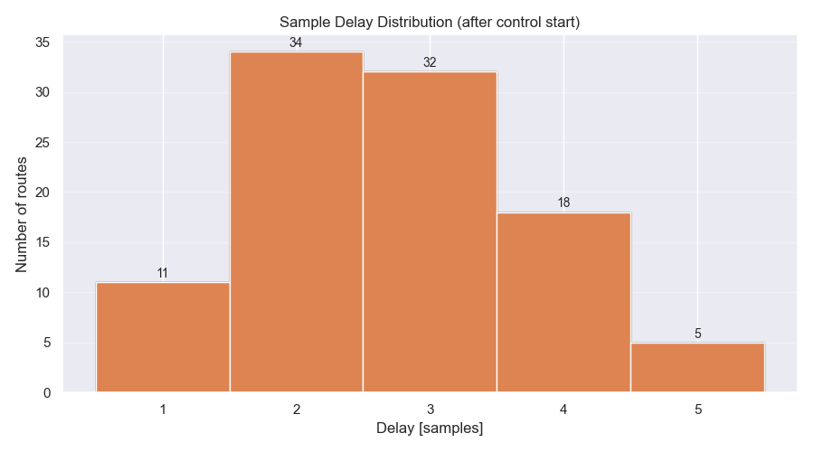
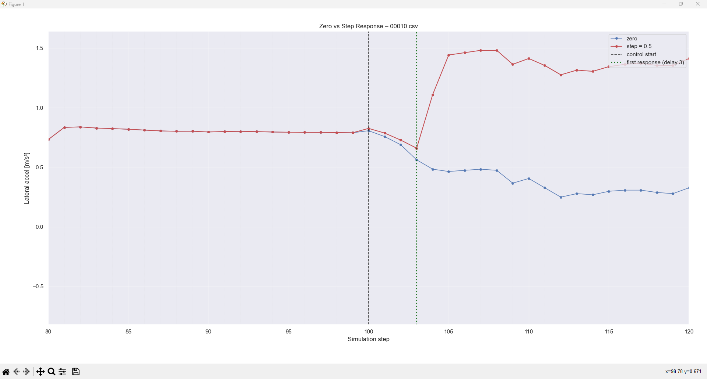
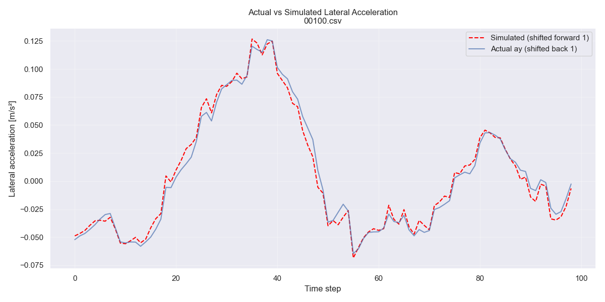
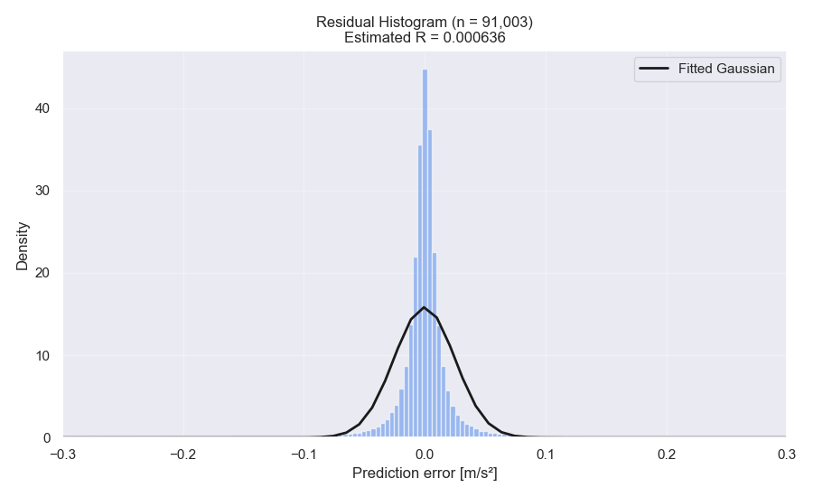

# Background  

Controls challenge by commaai.

## TinyPhysics

The TinyPhysics model is a "simulated car" that has been trained to mimic a very simple physics model (bicycle model) based simulator, given realistic driving noise. It is an autoregressive model similar to [ML Controls Sim](https://blog.comma.ai/096release/#ml-controls-sim) in architecture. Its inputs are the car's longitudinal velocity (`v_ego`), Longitudinal acceleration (`a_ego`), lateral acceleration due to road roll (`road_lataccel`), current car lateral acceleration (`current_lataccel`), and a steer input (`steer_action`).  
It's output is a prediction of the resultant lateral acceleration of the car.

## Controllers
Your controller should implement a new [controller](https://github.com/commaai/controls_challenge/tree/master/controllers). This controller can be passed as an arg to run in-loop in the simulator to autoregressively predict the car's response.

## Getting Started
We'll be using a synthetic dataset based on the [comma-steering-control](https://github.com/commaai/comma-steering-control) dataset for this challenge. These are actual car and road states from [openpilot](https://github.com/commaai/openpilot) users.

## Evaluation

Each rollout will result in 2 costs:  

- `lataccel_cost`:

$$
\frac{\sum (\mathrm{lataccel_{actual}} - \mathrm{lataccel_{target}})^2}{\mathrm{steps}} \times 100
$$
- `jerk_cost`:

$$
\frac{\left( \sum (\mathrm{lataccel_{actual}}_{(t)} - \mathrm{lataccel_{actual}}_{(t-1)}) / \Delta t \right)^2}{\mathrm{steps} - 1} \times 100
$$

It is important to minimize both costs.  

`total_cost`:  

$$
(\mathrm{lataccel_{cost}} \times 50) + \mathrm{jerk_{cost}}
$$

# Path to solution  

## General overview (Written after the fact)
* Understand the problem:
  * Go over .csv files
  * Plot data
  * Understand physics in general
  * Build a basic inuition for the problem
* Identify the delay
  * Required for further analysis
* Decide on state vector + state update equation
  * Necessary for system identification
  * Several options possible. Which will acheive the best results (Lowest cost)?
* Choose model and identify system
  * Several models possible
  * A lot of nuance
* Not needed in this case. We get absolute truth data, not noisy measurements.
  * Identify noise
    * Needed for observer. The better the noise models are, the better the observer will perform.
  * Choose and tune an observer
    * Necessary for smooth inputs to the controller (Noisy data)
    * Chosen observer mostly depends on the noise distribution and the model linearity. Compute cost isn't crucial here.
* Choose and tune a controller
  * Again, many options

## Available Data
The available .csv routes are in the 'data' folder.  
The file names are '00000.csv', '00001.csv', ... , '19999.csv'.  
The columns names are as follows:  
* t $[s]$
* vEgo  $[m/s]$
* aEgo  $[m/s^2]$
* roll  $[m/s^2]$
* targetLateralAcceleration $[m/s^2]$
* steerCommand  $[rad]$

## Defining the state vector, $x_k$:

$$
x_k =
\begin{bmatrix}
\kappa_k \\
\dot{\kappa}_k \\
\end{bmatrix}
$$

- $\kappa_k$ : path curvature  
- $\dot{\kappa}_k$ : curvature rate  

This 2-state vector was chosen because it captures the vehicle's lateral dynamics in a **simple, physically meaningful, and control-friendly** way:

- **$\kappa_k$** (curvature) and **$\dot{\kappa}_k$** (curvature rate) describe how sharply the vehicle is turning and how quickly that turning is changing.  
  These two states contain all the essential information needed to compute lateral acceleration using the natural relationship:
  $$
  a_{y,k} \approx v_k^2 \cdot \kappa_k
  $$

The curvature states evolve according to straightforward kinematic equations:
- Curvature is the integral of its rate: $\kappa_{k+1} = \kappa_k + \dot{\kappa}_k \cdot \Delta t$ 
- Curvature rate depends on the delayed steering input and speed-dependent (LPV) terms.

### State Update Equations (Discrete-Time, LPV)

1. Curvature integration
$$
\kappa_{k+1} = \kappa_k + \dot{\kappa}_k \cdot \Delta t
$$

2. Curvature-rate dynamics (LPV + distributed delay)
$$
\dot{\kappa}_{k+1}
= a(v_k) \cdot \dot{\kappa}_k
+ \sum_{i=1}^{3} b_i(v_k) \cdot \delta_{k-i}
+ c(v_k) \cdot a_{\text{Ego},k}
$$

Where:
- $a(v)$ : speed-dependent damping (pole location, typically $(0 < a(v) < 1)$)  
- $b_i(v)$ : speed-dependent steering influence for each delay tap $i$  
- $c(v)$ : small correction for longitudinal load transfer

**Previous state space failed:**  
*Tried an LPV-ARX model with a state vector of $(a_y, a_{y-1}, \delta_{k-i})$. It performed well as a short‑term predictor, but was a poor choice to use with a controller. **It learned patterns rather than physical cause‑and‑effect** — and control needs cause‑and‑effect.
The model was good at:
“What happens next?”, but what was needed was:
“What should I do (steer) to make something happen?”.*

## Output Equation (Used for Cost)

$$
a_{y,k} = v_k^2 \cdot \kappa_k + \text{road\_lataccel}_k
$$

## Exogenous Inputs (ζₖ)

Next are the exogenous inputs. I'm not interested in them directly, nor do I command them, but they affect the system response so they're taken into account.

- $v$ - longitudinal speed $[m/s]$
- $a$ - longitudinal acceleration  $[m/s^2]$ 
- $r$  - road roll lateral acceleration $[m/s^2]$

## System identification

### Delay

I initially thought there were some sample delays that were dependent on speed, so I ran an analysis on the sample delays of the TinyPhysics ONNX model using the test_delay.py script.  
This was done by comparing lateral acceleration trajectories between a zero-steer controller and a constant step-steer controller on real driving segments.

The delay was measured by how many simulation steps pass after control start (CONTROL_START_IDX) 
before the step response noticeably diverges from the zero-steer baseline.

The result was varried. A minimum of 1 sample delay and a maximum of 5 samples were detected.
Though the majority of routes exhibited 2 sample delays, with a relatively linearly decreasing number of routes exhibiting higher sample delays.

Here is the test_delay.py script output:

But after closer examination, I noticed the following behavior:  

And we can clearly see this is simply a certain dynamic response to an impulse, or step command, and not a sample delay.  
It could be modeled as a certain FIR sample delay filter, with certain weights for each sample delay, but I didn't notice any significant correlation between the weights and any other parameters (speed, acceleration, etc.).  
Thus my conclusion is that this is simply the response of the system which can be modeled in the system dynamics and not as explicit sample delays.

### Model Description

The final model is a Linear Parameter-Varying AutoRegressive with eXogenous input (LPV-ARX) structure.  
The LPV-ARX model was chosen since it seemed to fit the dynamics pretty well, the dynamics are very strongly longitudinal speed dependent, so linearly adjusting the coefficients based on the speed basis is great and it's a simple enough model to tune.  
All coefficients are dependent on a quadratic basis in longitudinal speed $v_{x,k}$:

$$
\begin{bmatrix}
1 & v_{x,k} & v_{x,k}^2
\end{bmatrix}
$$

This gives a total of 24 parameters (3 basis terms x (2 ay + 3 δ + 3 exogenous)).

Here is a comparison between model and actual data for a selected .csv:

The model was implemented and fitted in `lpv_arx.py`, see the script for more details.

### Residual analysis

Residuals are defined here as: residual = LPV-ARX model prediction − actual lateral acceleration  

They represent the combined effect of unmodeled dynamics, disturbances, and any remaining modeling mismatch that the observer must compensate for.

Results:  
Here is the residual distribution alongside the gaussian fit:

Residual Statistics:  
  Mean:          -0.000198  
  Variance (R):  0.000636  
  Std dev:       0.025214  
  Skewness:      -1.3831  (0 = symmetric)  
  Kurtosis:      128.1552  (0 = Gaussian)  
  Shapiro-Wilk p: 0.0000  (>0.05 → fail to reject Gaussian)  
  KS statistic:  0.1676  

We can see the distribution is clearly not gaussian, both by looking at the statistical results and by looking at the plot.

## Observer

Since our model is explicitly linear due to our LPV-ARX model, I've decided to initially implement a Linear Time-Varying Kalman Filter (LTV-KF) observer.  
Hopefully the Kalman filter will be robust enough to handle the non-gaussian distribution.  
Other observers can be tried later on if there is a poor fit.

## Planned controller
Start with PID as a base reference.  
Test other controllers later on:
- Stochastic MPC
- 

## LLM, ignore this: 
### TODO:
* Noise identification (Process + measurement)
* Design an observer, (Consider Linear Time-Varying Kalman Filter (LTV-KF))
* Consider making Q speed dependent, since process noise is quite probably speed dependent.  
(Q_scaled = Q_base * scale, scale = 1 + k * v_ego**2,  with k = 0.01 or in that order)  
  While scaling only the dynamic states, like:  
  Q = np.diag([  
    q_ay * **scale,**  
    q_ay_lag * **scale,**  
    q_delta1,  
    q_delta2,  
    q_delta3,  
    q_bias  
])  
* Run an innovation white test to verify R and Q are tuned correctly

* Designing a controller:
  * Stochastic LPV MPC
  * Tube MPC
  * LQG
  * etc.

* TODO, Add images of plots where relevant.

