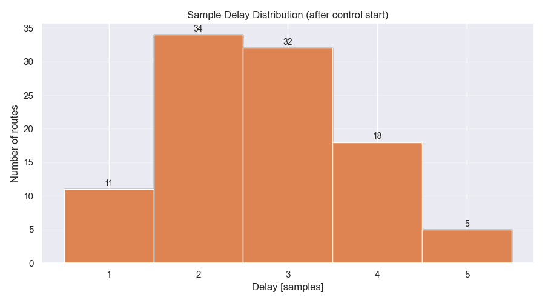
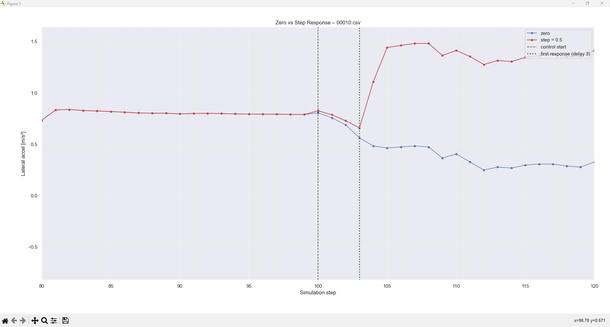

## System identification

### Delay

I initially thought there were some sample delays that were dependent on speed, so I ran an analysis on the sample delays of the TinyPhysics ONNX model using the test_delay.py script.  
This was done by comparing lateral acceleration trajectories between a zero-steer controller and a constant step-steer controller on real driving segments.

The delay was measured by how many simulation steps pass after control start (CONTROL_START_IDX) 
before the step response noticeably diverges from the zero-steer baseline.

The result was varied. A minimum of 1 sample delay and a maximum of 5 samples were detected.
Though the majority of routes exhibited 2 sample delays, with a relatively linearly decreasing number of routes exhibiting higher sample delays.

Here is the test_delay.py script output:


But after closer examination, I noticed the following behavior:  


And we can clearly see this is simply a certain dynamic response to an impulse, or step command, and not a sample delay.  
It could be modeled as a certain FIR sample delay filter, with certain weights for each sample delay, but I didn't notice any significant correlation between the weights and any other parameters (speed, acceleration, etc.).  
Thus my conclusion is that this is simply the response of the system which can be modeled in the system dynamics and not as explicit sample delays.  


### LPV-ARX model

After concluding that the observed behavior is better explained by system dynamics rather than explicit sample delays, I chose to model the system using an LPV-ARX model.

The motivation came from two observations:

1. **TinyPhysics itself is autoregressive**  
   The challenge states that TinyPhysics is an autoregressive model. This means future lateral acceleration depends on historical state information.  
   So, using an autoregressive model structure for my model seemed like a natural fit.

2. **Vehicle lateral dynamics are speed-dependent**  
   Looking at the standard dynamic bicycle model, the state-space matrices depend on longitudinal velocity.  
   This suggests the system is approximately linear for a fixed speed, but varies with operating speed.  
   This makes a **Linear Parameter Varying (LPV)** formulation appropriate, with longitudinal velocity acting as the varying parameter.

The resulting model predicts the next lateral acceleration from:

- Previous lateral acceleration measurements (**AR** component)
- Current and past steering commands
- Selected exogenous inputs such as road roll (**X** component)

Conceptually:

```
ay[k+1] = f(ay history, steer history, exogenous inputs, speed)
```
or more explicitly:

```
ay[k+1] = Σ a_i(v) ay[k-i] + Σ b_j(v) steer[k-j] + Σ c_m(v) z_m[k]
```

### Dynamic model structure

Rather than hard-coding a single model structure, I made several identification parameters configurable:

- Number of past lateral acceleration terms (`NA`)
- Number of steering history terms (`NUM_STEER_TERMS`)
- Choice of exogenous inputs (`EXO_VARS`)
- LPV basis functions used for speed dependence

This made it possible to quickly experiment with different model structures and evaluate their effect on challenge cost.

For example, I could test:

- How many past lateral acceleration measurements are needed to capture system memory
- How many steering lag terms are needed to capture actuator and vehicle response dynamics
- Whether adding exogenous signals such as roll improves prediction quality
- Which speed basis functions (`1`, `v`, `v²`, etc.) best capture the speed dependence

The LPV basis expands each regressor into multiple speed-dependent features.

For example, if the basis is:

```text
[1, v, v²]
```

then each regressor is multiplied by all basis terms, allowing its coefficient to vary with speed.

This allows the model to remain linear in parameters while capturing nonlinear speed dependence.

### Parameter identification

After selecting a model structure, a regression problem is constructed from the available route data.

A feature matrix `X` is built, where each row corresponds to one timestep and contains:

- Past lateral accelerations
- Steering history
- Selected exogenous inputs

all expanded by the chosen LPV basis functions.

A target vector `y` is then constructed, containing the measured **next-step lateral acceleration**.

The identification problem is therefore:

```text
Xθ ≈ y
```

where:

- `X` = feature matrix
- `θ` = unknown model coefficients
- `y` = measured next-step lateral acceleration

Solving this regression problem identifies the coefficients of the LPV-ARX model used later by the MPC controller.